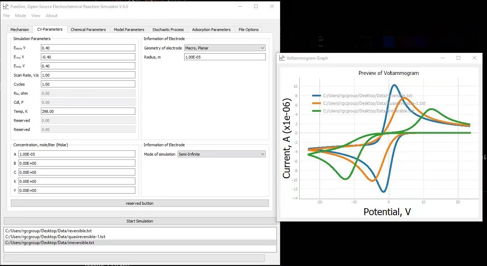

# FreeSim
 An Open-Source Electrochemical Reaction Simulator



FreeSim is a free simultor for electrochemical reaction by Haotian Chen and Professor Richard Compton at University of Oxford. 
We have now implemented ***7*** mechanisms, including:

* A + e = B, simple one electron reuduction 
* Stochastic A + e = B, stochastic one electron reduction using random walk algorithm
* A + e = B, B + e = C, two electron reduction
* A + e = B, B + B = C, EC2 reaction 
* A + e = B, B = C, EC reaction 
* X = A, A + e = B, CE reaction 
* X = A + C, A + e = B, dissociative CE reaction
* A + e = B， A<sub>abs</sub> + e = B<sub>abs</sub>, one eletctron reduction with adsorbed species, adsorption described with Langmuir Isotherm theory

Most of the mechanism support Butler-Volmer, Nernst and asymmetric Marcus-Hush kinetics. Radial and linear diffusions are also supported in most mechanisms. Prequilibrium of species are supported in CE and dissociative CE reactions. Semi-infinite and thin-layer boundary conditions are supported.

Chronoamperometry of most mechanisms are supported. 


# Installs
A few common packages including PyQt5, pyqtgraph, Sympy, Numpy and Pandas are required to be installed. Python version 3.6 and above is recommended

```
$ pip install PyQt5
$ pip install pyqtgraph
$ pip install sympy
$ pip install numpy
$ pip install pandas
$ pip install scipy
```

The packages can also be installed using the *requirement.txt*

```
$ pip install -r requirement.txt
```

To run,

```
$ python MainWindow.py
```

# Case Studies
Case studies are perfect starting point for simulations. The cases allow you to input simulation parameters according to the parameter guide provided and see the nice agreement with experiments! The cases provided in the *Case Study* folder are:

* Case Study\MeNP reduction at a hemispherical electrode
* Case Study\RuHex Au macroelectrode CV

Each case comes with a *Background and Parameters.md* file for the experimental backgrounds and parameters. An experimental voltammogram is provided too. In addition, if you don't want to type these parameters mannually, **you can just load the *Simulation Seeting.pkl* file and run the simulations!**


# Future plans
The authors may include 2-D simulation of a microdisc elelctrode. You may also leave your preferred mechanism in the discussion forum and we will try our best to consider that! 


# Disclaimers
Since the software is offered free of charge under GNU public license, we do not offer gurantees on the results of simulations and offer absolute no warranties to the software. The authors would try their best to respond to any bugs as soon as possible. Thanks for your understanding.


